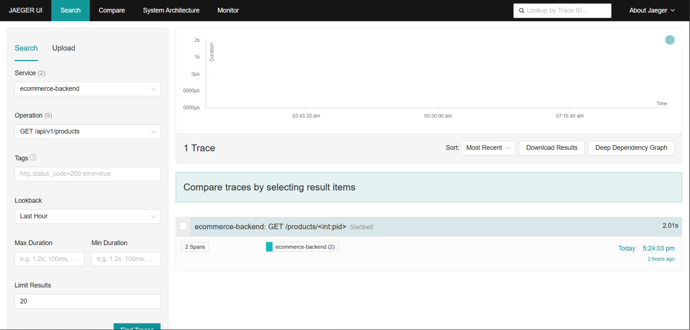
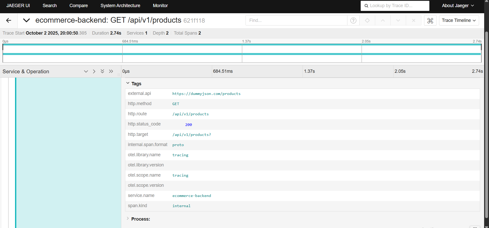

#### Understanding opentelemetry from begineer POV

**What is opentelemetry**

OpenTelemetry is an open-source observability framework for instrumenting, collecting, and exporting telemetry data—traces, metrics, and logs—from distributed systems and modern applications


<p align="center">
  <a href="https://opentelemetry.io/docs/what-is-opentelemetry/">
    
  </a>
</p>

<h1 align="center">
  opentelemetry Analytics
</h1>


### Steps to run the project locally


```bash
git clone https://github.com/uchiha-vivek/Monitoring-performance-with-opentelemetry-and-prometheus.git
cd Monitoring-performance-with-opentelemetry-and-prometheus
```

Make virtual environment

```bash
python -m venv venv
```

Activate the environment

```bash
venv\Scripts\activate
```

Install the requirements

```bash
pip install -r requirements.txt
```

run the main file

```bash
python app.py
```


Make sure to run docker dameon :

- open the docker desktop

 ```bash
docker-compose up -d
```

Hit the following endpoint to view the **JAEGER GUI** 
```http://localhost:16686/search```


## What to do in Jaeger

<a href="https://opentelemetry.io/docs/what-is-opentelemetry/">
    
</a>


- Select the service you defined in __tracing.py__ . In our case its **ecommerce-backend**
- In the operation panel , you can see the **METHOD** and the endpoint

The info you can view 

<a href="https://opentelemetry.io/docs/what-is-opentelemetry/">
    
</a>

- you can see the http method
- you can view the external api being used here
- you can view the system defined route ```/api/v1/route```
- you can see the **otel.scope.name** and **otel.library.name**
- service name is also mentioned
- you can view the duration of the __api request__


Hit the following endpoints 

Endpoint 1:

```bash
http://localhost:5000/api/v1/products
```

endpoint 2:
```bash
http://localhost:5000/api/v1/products/1
```


## Future integrations to be made

- will be deploying the code in Azure web app 
- enabling azure analytics by using **azure-monitor-telemetry**
- reference material for setting up opentelemetry in azure - [LINK](https://learn.microsoft.com/en-us/azure/azure-monitor/app/opentelemetry-enable?tabs=python)
- enabling prometheus for spikes and latency